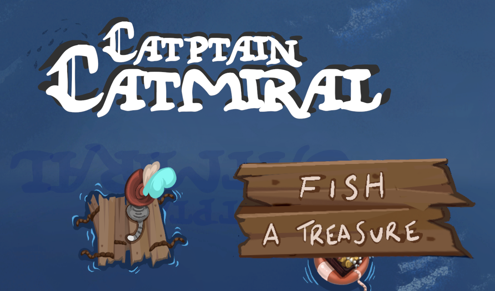
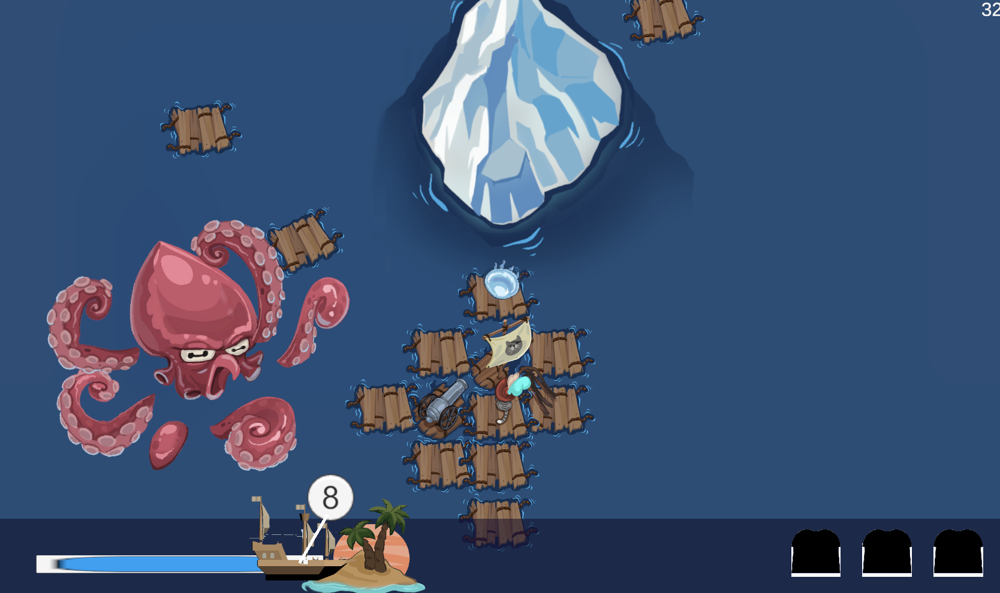

# GlobalGameJam 01/2021

This is a game created for the Global Game Jam 2021.
Find more info about the entry here https://globalgamejam.org/2021/games/catmiral-fish-treasure-1

**Play right now!**
https://exantares.github.io/GlobalGameJam012021/

# Game and how to play

You are the last member of your crew. The last battles have left your ship in a deplorable state. You are now drifting through the sea, gathering everything you can find in order to survive the dangerous waters. Will you make it to a safe spot and earn something extra on the way?

 - Collect treasure
 - Collect pieces of ships
 - Protect your boat

 

Requires mouse to play.

# Team
 - Andy Michael ([GustoGaiden - GitHub](https://github.com/GustoGaiden))
 - Berta Laurin ([Berta Laurin - Artstation](https://berta_laurin.artstation.com/))
 - Luis Rojas ([exAntares - GitHub](https://github.com/exAntares))
 - Oriana Laplana ([cegata - Facebook](https://www.facebook.com/cegata/))
 - Sergio R. Lumley ([lumley - GitHub](https://github.com/lumley/))

## Special thanks
 - Irina
 - Niklas
 - Nico
We thank you for setting up the event and for joining us. The complexities of building a game in such a short time all in remote can make things even harder than a regular game jam. We are still very grateful for your contributions and hope to see you in more of these!

# Technologies
[Unity 2020.2.2f1](https://unity3d.com/get-unity/download/archive)
